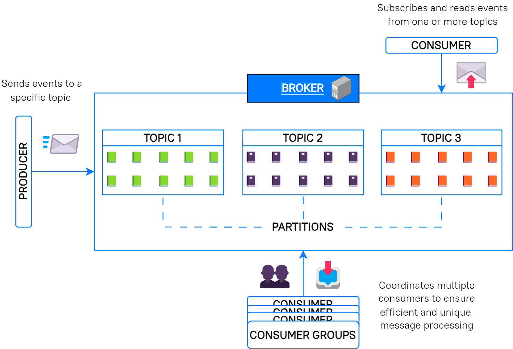

## What is Kafka?

[Kafka](https://kafka.apache.org/intro) is a distributed event streaming platform. Initially developed by LinkedIn, Kafka was subsequently contributed to the Apache Software Foundation and made open-source. This transition marked its role as a key participant in real-time data streaming.

More than a simple communication tool, Kafka is an “event broker” — a system that controls and handles events or messages between various applications or services. It can handle massive daily event volumes as a distributed event streaming platform, guaranteeing that data is seamlessly transported and analyzed in real time.

Apart from its fundamental role as an event broker, Kafka offers durability, scalability, and fault-tolerance features. It also helps ensure that large-scale data streams are managed efficiently and reliably with very low latency.

---

## Kafka’s core components ⚙️

Let’s dive into the main elements that make up its architecture:

### Events

An event records the fact that “something happened”. It can be thought of as a message or a piece of data representing a change or an action. In the context of our real-time notification system, we could consider an event as follows:

- Event key: “1” (representing the user ID for Emma)
- Event value: “Bruno started following you.”

### Brokers

A Kafka broker is a server that runs the Kafka software and stores data. While large-scale production setups often involve multiple brokers across several machines, we’ll use a single broker setup for this project.

### Topics

Topics in Kafka are similar to folders in a filesystem. They represent categories under which data or events are stored. For instance, an example topic name could be "notifications".

### Producers

Producers are entities that publish (write) or send messages to Kafka, such as a Go program or a service. When a producer has an event to send, it chooses a topic to address the event to.

### Consumers

Consumers read and process events or messages from Kafka. After producers send messages to topics, consumers can subscribe to one or more topics to receive the messages.

### Partitions

Each topic in Kafka can be further divided into partitions. Think of partitions as segments within a topic that enable Kafka to manage data more efficiently, especially in setups with multiple brokers.

### Consumer groups

While individual consumers handle messages from specific partitions, consumer groups manage coordination across multiple consumers.

A consumer group consists of multiple consumers collaboratively processing messages from different partitions of a topic. This ensures that each message from a partition is processed by just one consumer in the group, allowing for efficient and scalable consumption.

Think of it as a team of consumers working together, with each member responsible for messages from specific partitions, ensuring no message is overlooked.

### Replicas

Replication ensures data safety. In larger Kafka deployments, storing multiple data replicas is common to help recover from unexpected failures.

### KRaft

[KRaft](https://developer.confluent.io/learn/kraft/) is Kafka’s own consensus protocol introduced to eliminate the need for [ZooKeeper](https://kafka.apache.org/documentation/#zk_depr). In short, KRaft manages metadata directly within Kafka, providing scalability, simplicity, and improved failover, among other benefits.

To tie all these components together, here’s a visual representation of Kafka’s core architecture, illustrating a broker, topics, partitions, and consumer groups:


> Visualizing Kafka’s event streaming Architecture

---

## Set up the project workspace for your Kafka-based notification system

### 1. Create the Project Directory

First, create a directory for the project called `kafka-notify` and navigate into it.

```bash
mkdir kafka-notify && cd kafka-notify
```

### 2. Download the Kafka Docker Compose File

Pull the `docker-compose.yml` file for Kafka from [Bitnami's repository](https://hub.docker.com/r/bitnami/kafka/).

```bash
curl -sSL https://raw.githubusercontent.com/bitnami/containers/main/bitnami/kafka/docker-compose.yml > docker-compose.yml
```

### 3. Modify the `docker-compose.yml` File

Before starting Kafka, we need to modify a setting in the `docker-compose.yml` file.

- Open the `docker-compose.yml` file in your text editor.
- Find the following line:

  ```yaml
  KAFKA_CFG_ADVERTISED_LISTENERS=PLAINTEXT://:9092
  ```

- Replace it with:
  ```yaml
  KAFKA_CFG_ADVERTISED_LISTENERS=PLAINTEXT://localhost:9092
  ```
  This change ensures Kafka advertises its listener on localhost, allowing our local Go application to connect seamlessly.

### 4. Start the Kafka Broker

Run the following command to start the container in detached mode:

```bash
docker-compose up -d
```

This will download and start the Kafka container in the background.

### 5. Create Project Directories

Create the necessary directories to organize your project files. The directories `cmd/producer` and `cmd/consumer` will contain the producer and consumer application files, and `pkg/models` will store the model declarations.

```bash
mkdir -p cmd/producer cmd/consumer pkg/models
```

### 6. 6. Initialize Go Modules

Initialize a Go module for our project and install the necessary dependencies. In this case, we'll be using sarama (a Kafka client for Go) and gin (a web framework for Go) for the application.

Initialize the Go module:

```bash
go mod init kafka-notify
```

Install the required Go packages:

```bash
go get github.com/IBM/sarama github.com/gin-gonic/gin
```

### 7. Project Structure Overview

The project structure should look like this:

```
kafka-notify/
├── cmd/
│ ├── producer/
│ └── consumer/
├── pkg/
│ └── models/
├── docker-compose.yml
├── go.mod
```

- `cmd/producer/`: This directory will contain the Go code for the producer (to send messages to Kafka).
- `cmd/consumer/`: This directory will contain the Go code for the consumer (to read messages from Kafka).
- `pkg/models/`: This directory will hold your data models (such as notification structures).
- `docker-compose.yml`: The configuration for Docker to run Kafka.
- `go.mod`: The Go module file that tracks dependencies.
